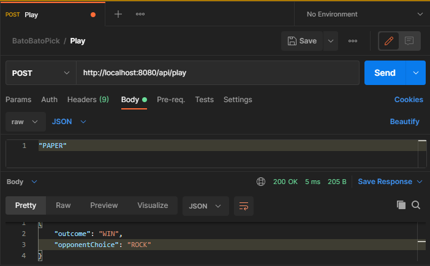

Bato Bato Pick (Rock Paper Scissors)
====================================

## Background

### What is Bato Bato Pick?
Bato Bato Pick is the Philippine version of Rock, Paper, Scissors (https://en.wikipedia.org/wiki/Rock_paper_scissors). 
This is the game children (and adults as well) play to determine who will go 
first on any challenge or who will get the prize.

### How it works?
This is an implementation of my own version of the game using Spring Boot. 
It accepts a single REST API POST action of either ("ROCK" | "PAPER" | "SCISSORS") to return a result.
The computer acts as the second player

### Why did I create this?
This was a coding exercise for a position that I was applying for in an **awesome** team 
with an **awesome** project.


## Getting Started
Deploying locally:
```
gradlew clean bootRun
```

Sample Calls:
```
curl -X POST http://localhost:8080/api/play --header "Content-Type: application/json" --data-raw \"PAPER\"
```



